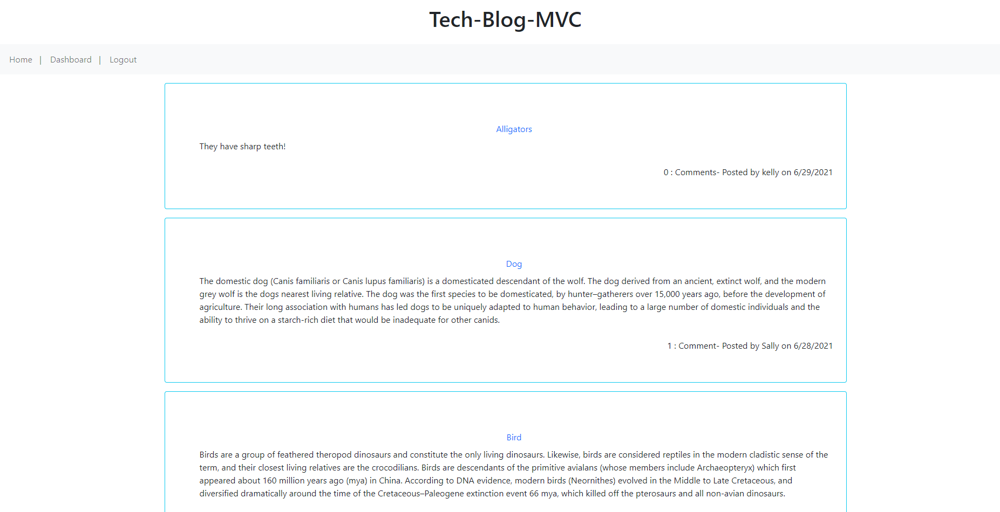
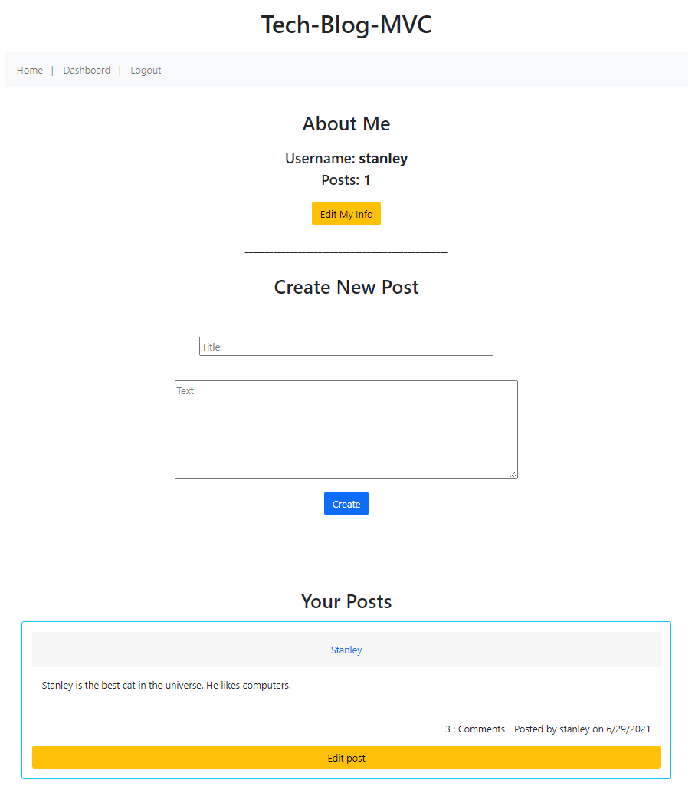

# Tech-Blog-MVC
## About Tech-Blog-MVC

The purpose of this educational assignment was to practice the MVC (model/view/controller) and CRUD (create/read/update/delete) development process, creating an interactive 'tech blog'. 

1. Present user with homepage of posts
2. User cannot access the features until they are logged in
3. Users are prompted on the 'login' page to enter creditials or 'sign up'
4. New users are taken to a 'sign up' page to enter new creditials
5. After existing or new user logs in/signs up, they are taken to their 'dashboard'
6. On the dashboard, they can 'edit' their user info, 'create' a new post, and 'edit' existing posts
7. Additionally, users can click on each post on the 'homepage' and post comments
8. These comments can also be 'edited' and 'delete'

## Use:

User can create/write a tech blog, post, publish, and comment with others.

Install:
* npm install
make sure all are installed: (bcrypt, dotenv, express, handlebars, mysql2, sequelize)

If running on local machine to test run:
* mysql -u root -p
* source db/schema.sql
* quit
* npm run seed
* npm start

*Used to learn, practice, test, understand, and implement various fullstack dev and database deployment (MySQL/Heroku/JAWSDB) tools: 

* CRUD
* MVC
* MySQL workbench, Heroku, JAWSDB
* Handlebars
* create and display routes 
* create and use models
* primary and foreign keys
* dotenv file 
* bcrypt

## Contacts/Deployed links:

* https://github.com/kitclong/Tech-Blog-MVC
* https://stark-spire-15339.herokuapp.com/

## Acknowledgments:

* npm
* Heroku and JAWSDB
* MDN Web Docs
* w3schools
* Stackoverflow
* Freecodecamp
* Trilogy Education services
* Local tutoring services (thank you)
* Additional private tutoring (sorry)
